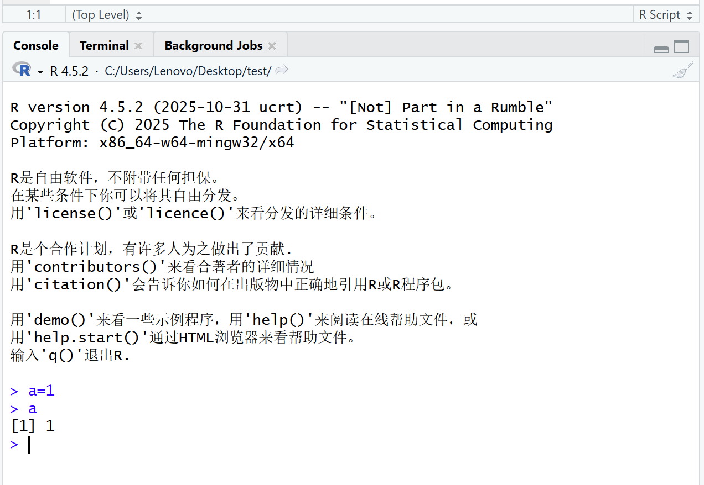
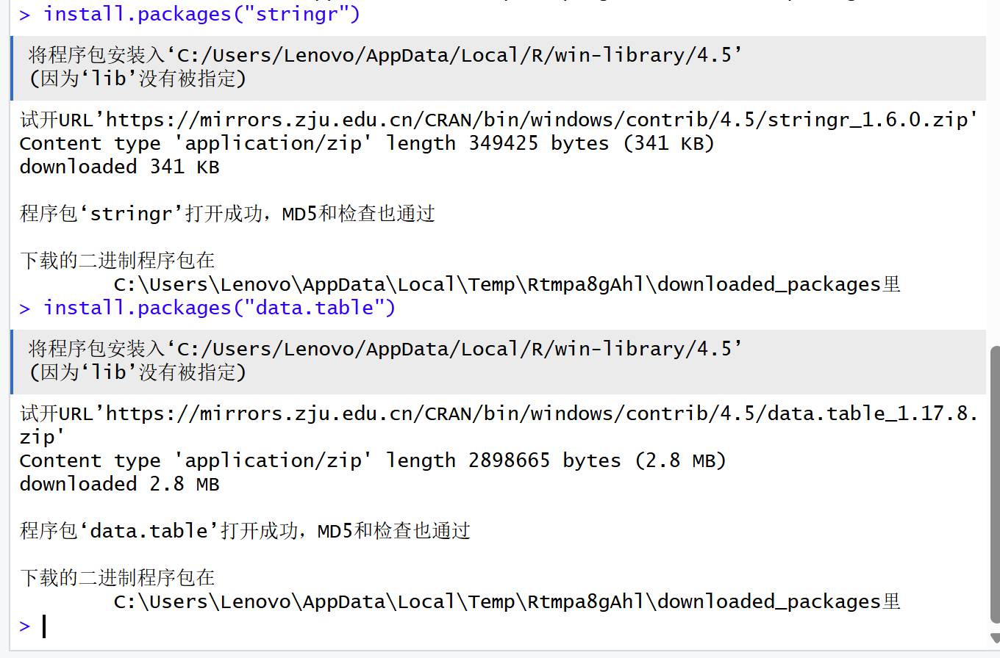
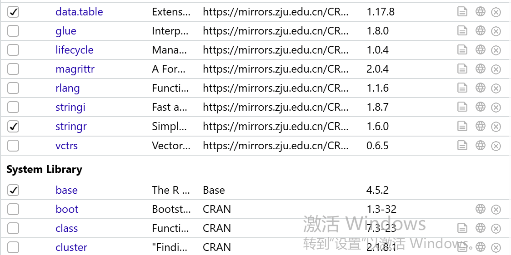
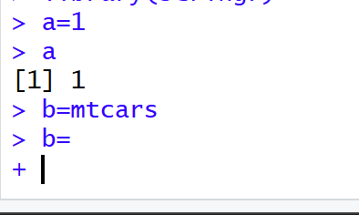
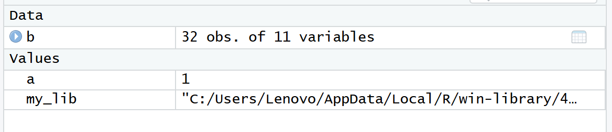

**作业1** 1.R是统计计算/可视化语言，起源于S语言，用于统计分析、数据可视化等工作 2.RStudio是R的IDE，R是语言本体，RStudio是辅助开发的工具 3.  4. 5.6. **作业2** 1.一行代码：选中行按Ctrl+Enter；多行代码：选中多行按Ctrl+Enter 2. 3.安装函数是install.packages()  4.导入函数是library() 在右下角Packages面板查看已导入包  5.包不需要重新安装，需要重新导入 6.赋值符号\<-，快捷键Alt+-，代码a \<- 1; b \<- mtcars  7. 8.单行用#，多行用Ctrl+Shift+C快捷键
